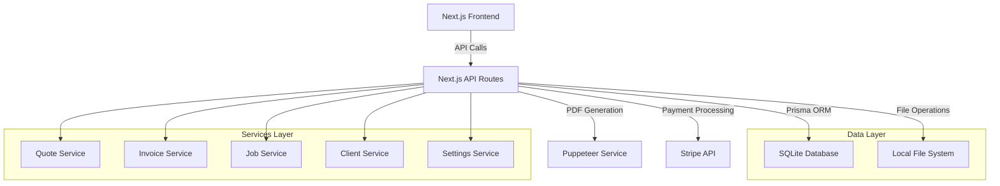

# 3D Print Sydney - Comprehensive Developer Documentation
Default admin user: admin@3dprintsydney.com / “admin”
## Table of Contents

1. [Overview](#overview)
2. [Architecture](#architecture)
3. [Quick Start](#quick-start)
4. [Project Structure](#project-structure)
5. [Core Features](#core-features)
6. [Database Schema](#database-schema)
7. [API Documentation](#api-documentation)
8. [Component Architecture](#component-architecture)
9. [Development Workflow](#development-workflow)
10. [Configuration](#configuration)
11. [File Storage](#file-storage)
12. [Design System](#design-system)
13. [Testing](#testing)
14. [Deployment](#deployment)
15. [Troubleshooting](#troubleshooting)

---

## Overview

**3D Print Sydney Console** is a local-first business management application for boutique 3D printing operations. Built with Next.js 15, it provides comprehensive quote-to-cash functionality with automated job queue management.

### Key Characteristics

- **Local-First**: All data stored locally in SQLite, files in `data/` directory
- **Full-Stack**: Next.js with API routes, React components, and Prisma ORM
- **Business-Focused**: Optimized for 3D printing business workflows
- **Self-Contained**: No external dependencies except Stripe (optional)

### Technology Stack

| Layer | Technology |
|-------|------------|
| **Frontend** | React 19, Next.js 15, Tailwind CSS, shadcn/ui |
| **Backend** | Next.js API Routes, Prisma ORM |
| **Database** | SQLite (local file) |
| **State Management** | Zustand, TanStack Query |
| **File Storage** | Local filesystem (`data/` directory) |
| **PDF Generation** | Puppeteer |
| **Payments** | Stripe (legacy integration) |
| **Type Safety** | TypeScript, Zod validation |

---

## Architecture

### System Architecture



### Data Flow

1. **Quote Creation** → **Invoice Generation** → **Payment Processing** → **Job Creation** → **Queue Management**
2. **Client Management** runs parallel to all business operations
3. **Activity Logging** captures all state changes
4. **File Attachments** stored per invoice with metadata

### Local-First Design

- **Database**: `data/app.db` (SQLite)
- **Files**: `data/files/<invoiceId>/` (attachments)
- **PDFs**: `data/pdfs/` (generated documents)
- **Configuration**: Environment variables + database settings

---

## Quick Start

### Prerequisites

- Node.js 20+
- npm 10+

### One-Command Setup

```bash
# Clone and start
npm run up
```

This command:
1. Installs dependencies
2. Generates Prisma client
3. Creates database schema
4. Seeds sample data
5. Starts development server at http://localhost:3000

### Manual Setup

```bash
npm install
npm run prisma           # Generate Prisma client
npm run db:migrate       # Apply database migrations
npm run db:seed          # Seed sample data
npm run dev              # Start development server
```

### Production Build

```bash
npm run build           # Build for production
npm run start          # Start production server
```

---

## Project Structure

```
3dprintsydney/
├── README.md                   # Main project documentation
├── START_HERE.md              # Quick start guide
├── DESIGN_SYSTEM.md           # UI design system documentation
├── DEVELOPER_DOCUMENTATION.md # This file
├── package.json               # Dependencies and scripts
├── next.config.ts             # Next.js configuration
├── tailwind.config.js         # Tailwind CSS configuration
├── tsconfig.json             # TypeScript configuration
├── prisma/
│   ├── schema.prisma         # Database schema
│   └── seed.ts               # Database seeding script
├── data/                     # Local data storage (gitignored)
│   ├── app.db               # SQLite database
│   ├── files/               # Invoice attachments
│   └── pdfs/                # Generated PDFs
├── src/
│   ├── app/                 # Next.js app directory
│   │   ├── layout.tsx       # Root layout
│   │   ├── page.tsx         # Dashboard page
│   │   ├── globals.css      # Global styles
│   │   ├── api/             # API routes
│   │   │   ├── clients/     # Client management APIs
│   │   │   ├── quotes/      # Quote management APIs
│   │   │   ├── invoices/    # Invoice management APIs
│   │   │   ├── jobs/        # Job management APIs
│   │   │   ├── settings/    # Settings APIs
│   │   │   └── stripe/      # Stripe webhook
│   │   ├── clients/         # Client pages
│   │   ├── quotes/          # Quote pages
│   │   ├── invoices/        # Invoice pages
│   │   ├── jobs/            # Job management pages
│   │   └── settings/        # Settings pages
│   ├── components/          # React components
│   │   ├── ui/              # Base UI components (shadcn/ui)
│   │   ├── clients/         # Client-specific components
│   │   ├── quotes/          # Quote-specific components
│   │   ├── invoices/        # Invoice-specific components
│   │   ├── jobs/            # Job-specific components
│   │   ├── dashboard/       # Dashboard components
│   │   └── layout/          # Layout components
│   ├── lib/                 # Utility functions
│   │   ├── utils.ts         # Common utilities
│   │   ├── calculations.ts  # Business calculations
│   │   ├── currency.ts      # Currency formatting
│   │   ├── datetime.ts      # Date/time utilities
│   │   ├── logger.ts        # Logging utility
│   │   ├── schemas/         # Zod validation schemas
│   │   └── types.ts         # TypeScript type definitions
│   ├── server/              # Server-side code
│   │   ├── db/              # Database client
│   │   ├── services/        # Business logic services
│   │   ├── pdf/             # PDF generation
│   │   ├── files/           # File storage
│   │   ├── config/          # Server configuration
│   │   └── validators/      # Server-side validation
│   ├── hooks/               # Custom React hooks
│   ├── providers/           # React context providers
│   └── styles/              # CSS and design tokens
├── docs/                    # Project documentation
│   ├── Vision-and-Scope.md # Project vision
│   ├── Feature-Blueprint.md # Feature specifications
│   └── build/               # Build documentation
└── scripts/                 # Build and utility scripts
    ├── up.sh               # Setup script
    └── smoke.ts            # Smoke tests
```

---

## Core Features

### 1. Quote Management

**Purpose**: Create, manage, and convert quotes to invoices

**Key Components**:
- `src/components/quotes/quote-view.tsx` - Main quote interface
- `src/server/services/quotes.ts` - Business logic
- `src/app/api/quotes/` - API endpoints

**Workflow**:
1. Draft → Pending → Accepted/Declined → Converted to Invoice
2. Calculator integration for 3D print pricing
3. PDF generation for client delivery
4. Activity logging for audit trail

**API Endpoints**:
- `GET /api/quotes` - List all quotes
- `POST /api/quotes` - Create new quote
- `GET /api/quotes/[id]` - Get quote details
- `PUT /api/quotes/[id]` - Update quote
- `POST /api/quotes/[id]/convert` - Convert to invoice
- `GET /api/quotes/[id]/pdf` - Generate PDF

### 2. Invoice Management

**Purpose**: Track payments, manage billing lifecycle

**Key Components**:
- `src/components/invoices/invoice-view.tsx` - Main interface
- `src/server/services/invoices.ts` - Business logic
- Stripe integration for online payments

**Workflow**:
1. Created from quote or standalone
2. Payment processing (Stripe/manual)
3. Job creation based on payment policy
4. File attachment management

**Features**:
- Multiple payment methods
- Automatic balance calculation
- Stripe checkout integration
- File attachments per invoice
- Void/write-off capabilities

### 3. Job Queue Management

**Purpose**: Manage print jobs across multiple printers

**Key Components**:
- `src/components/jobs/jobs-board.tsx` - Drag-and-drop interface
- `src/server/services/jobs.ts` - Job lifecycle management

**Features**:
- Auto-creation from paid invoices
- Drag-and-drop between printers
- Status tracking (Queued → Printing → Completed)
- Priority management
- Time tracking (estimated vs actual)

### 4. Client Management

**Purpose**: Central customer database with history

**Key Components**:
- `src/components/clients/client-view.tsx` - Client details
- Activity timeline with notes
- Payment terms management

**Features**:
- Contact information management
- Quote/invoice history
- Internal notes and activity log
- Payment terms configuration

### 5. Settings & Configuration

**Purpose**: Business configuration and preferences

**Categories**:
- Business identity (name, address, ABN)
- Tax rates and payment terms
- Numbering prefixes
- Job automation policies
- Stripe configuration

---

## Database Schema

### Core Entities

```sql
-- Settings: Business configuration
CREATE TABLE Settings (
  id INTEGER PRIMARY KEY DEFAULT 1,
  businessName TEXT DEFAULT '',
  taxRate DECIMAL,
  jobCreationPolicy TEXT DEFAULT 'ON_PAYMENT'
  -- ... other business settings
);

-- Clients: Customer information
CREATE TABLE Client (
  id INTEGER PRIMARY KEY AUTOINCREMENT,
  name TEXT NOT NULL,
  company TEXT,
  email TEXT,
  -- ... contact information
);

-- Quotes: Sales proposals
CREATE TABLE Quote (
  id INTEGER PRIMARY KEY AUTOINCREMENT,
  number TEXT UNIQUE NOT NULL,
  clientId INTEGER REFERENCES Client(id),
  status TEXT DEFAULT 'DRAFT',
  total DECIMAL NOT NULL,
  -- ... pricing and lifecycle fields
);

-- Invoices: Bills for payment
CREATE TABLE Invoice (
  id INTEGER PRIMARY KEY AUTOINCREMENT,
  number TEXT UNIQUE NOT NULL,
  clientId INTEGER REFERENCES Client(id),
  sourceQuoteId INTEGER REFERENCES Quote(id),
  status TEXT DEFAULT 'PENDING',
  total DECIMAL NOT NULL,
  balanceDue DECIMAL NOT NULL,
  -- ... payment and lifecycle fields
);

-- Jobs: Print queue items
CREATE TABLE Job (
  id INTEGER PRIMARY KEY AUTOINCREMENT,
  invoiceId INTEGER REFERENCES Invoice(id),
  printerId INTEGER REFERENCES Printer(id),
  status TEXT DEFAULT 'QUEUED',
  priority TEXT DEFAULT 'NORMAL',
  -- ... queue and timing fields
);
```

### Key Relationships

- **Quote** → **Invoice** (conversion)
- **Invoice** → **Job** (auto-creation on payment)
- **Client** → **Quotes/Invoices** (one-to-many)
- **Printer** → **Jobs** (assignment)

### Enums and Status Values

```typescript
// Quote lifecycle
enum QuoteStatus {
  DRAFT, PENDING, ACCEPTED, DECLINED, CONVERTED
}

// Invoice payment status
enum InvoiceStatus {
  PENDING, PAID, OVERDUE
}

// Job queue status
enum JobStatus {
  QUEUED, PRINTING, PAUSED, COMPLETED, CANCELLED
}

// Printer availability
enum PrinterStatus {
  ACTIVE, MAINTENANCE, OFFLINE
}
```

---

## API Documentation

### Standard Response Format

```typescript
// Success Response
{
  data: T,           // Response payload
  message?: string   // Optional success message
}

// Error Response
{
  error: string,     // Error message
  details?: any      // Optional error details
}
```

### Authentication

Session cookie authentication with role-based access:

- Users have roles: `ADMIN` or `CLIENT`.
- Admin has full access to all resources; clients are scoped to their own `clientId`.
- Client portal routes: `/client`, `/client/orders`, `/client/orders/[id]`, `/client/messages`, `/quick-order`.
- Admin portal routes: dashboard and all owner modules; clients are redirected away from admin routes.

### Core API Routes

#### Quotes API

```typescript
// GET /api/quotes
// Returns: Quote[] with client and items

// POST /api/quotes
// Body: QuoteInput
// Returns: Quote with generated number

// PUT /api/quotes/[id]
// Body: Partial<QuoteInput>
// Returns: Updated Quote

// POST /api/quotes/[id]/convert
// Returns: Created Invoice

// GET /api/quotes/[id]/pdf
// Returns: PDF blob
```

#### Invoices API

```typescript
// GET /api/invoices
// Returns: Invoice[] with payments and attachments

// POST /api/invoices
// Body: InvoiceInput
// Returns: Invoice with generated number

// POST /api/invoices/[id]/payments
// Body: PaymentInput
// Returns: Updated Invoice with new payment

// POST /api/invoices/[id]/void
// Body: { reason: string }
// Returns: Voided Invoice
```

#### Jobs API

```typescript
// GET /api/jobs
// Returns: Job[] grouped by printer

// PUT /api/jobs/[id]/assign
// Body: { printerId: number }
// Returns: Updated Job

// PUT /api/jobs/[id]/status
// Body: { status: JobStatus, notes?: string }
// Returns: Updated Job

// POST /api/jobs/bulk-archive
// Body: { jobIds: number[] }
// Returns: { archived: number }
```

---

## Component Architecture

### Design Philosophy

- **Composition over inheritance**
- **Co-location of related components**
- **shadcn/ui as base component library**
- **Feature-based organization**

### Component Hierarchy

```
App Layout
├── AppShell (navigation, sidebar)
├── Page Components (quotes-view, invoices-view, etc.)
├── Feature Components (quote-form, invoice-list, etc.)
├── UI Components (button, dialog, table)
└── Providers (theme, query client)
```

### Key Patterns

#### 1. View Components

Main page components that handle routing and data fetching:

```typescript
// src/components/quotes/quotes-view.tsx
export function QuotesView() {
  const { data: quotes, isLoading } = useQuotes();
  
  return (
    <div className="space-y-6">
      <QuotesHeader />
      <QuotesTable quotes={quotes} />
      <QuoteDialog />
    </div>
  );
}
```

#### 2. Form Components

Handle user input with validation:

```typescript
// Uses react-hook-form + zod validation
export function QuoteForm({ quote, onSubmit }: QuoteFormProps) {
  const form = useForm<QuoteInput>({
    resolver: zodResolver(quoteInputSchema),
    defaultValues: quote
  });
  
  return (
    <Form {...form}>
      {/* Form fields */}
    </Form>
  );
}
```

#### 3. Data Components

Handle API interactions:

```typescript
// Custom hooks for data fetching
export function useQuotes() {
  return useQuery({
    queryKey: ['quotes'],
    queryFn: () => fetchQuotes()
  });
}
```

### State Management

#### TanStack Query

Used for server state management:

```typescript
// Query for fetching data
const quotesQuery = useQuery({
  queryKey: ['quotes'],
  queryFn: fetchQuotes
});

// Mutation for updates
const createQuoteMutation = useMutation({
  mutationFn: createQuote,
  onSuccess: () => {
    queryClient.invalidateQueries(['quotes']);
  }
});
```

#### Zustand

Used for client-side state:

```typescript
// src/hooks/use-quote-store.ts
const useQuoteStore = create<QuoteStore>((set) => ({
  selectedQuote: null,
  setSelectedQuote: (quote) => set({ selectedQuote: quote }),
  // ... other state
}));
```

---

## Development Workflow

### Code Quality Tools

```bash
npm run lint          # ESLint checking
npm run format        # Prettier formatting
npm run format:write  # Apply Prettier fixes
npm run typecheck     # TypeScript validation
npm run build         # Production build (includes lint+typecheck)
npm run audit         # Security audit
```

### Development Standards

#### 1. Code Organization

- **Feature-based folders** in `src/components/`
- **Co-locate related files** (component + styles + tests)
- **Barrel exports** for clean imports

#### 2. TypeScript Usage

- **Strict mode enabled**
- **Zod schemas** for runtime validation
- **Generated types** from Prisma schema

#### 3. Component Development

- **Use shadcn/ui components** as base
- **Compose rather than customize**
- **Props interface** for all components

#### 4. API Development

- **Zod validation** on all inputs
- **Error handling** with proper HTTP codes
- **Activity logging** for audit trails

### Database Migrations

```bash
# Generate migration from schema changes
npx prisma migrate dev --name add_feature

# Apply migrations to production
npx prisma migrate deploy

# Reset database (development)
npx prisma migrate reset

# View database
npx prisma studio
```

### File Structure Conventions

```typescript
// Feature folder structure
src/components/quotes/
├── index.ts           # Barrel export
├── quotes-view.tsx    # Main view component
├── quote-form.tsx     # Form component
├── quote-table.tsx    # List component
└── quote-dialog.tsx   # Modal component

// Hook organization
src/hooks/
├── use-quotes.ts      # Data fetching hooks
├── use-quote-form.ts  # Form management
└── use-quote-store.ts # State management
```

---

## Configuration

### Environment Variables

Create `.env.local` for local development:

```bash
# Database
DATABASE_URL="file:./data/app.db"

# Stripe (optional)
STRIPE_SECRET_KEY="sk_test_..."
STRIPE_WEBHOOK_SECRET="whsec_..."

# Development
NODE_ENV="development"
```

### Settings Management

Application settings stored in database `Settings` table:

```typescript
// Accessed via settings service
const settings = await getSettings();

// Updated via settings API
PUT /api/settings {
  businessName: "New Name",
  taxRate: 0.10,
  jobCreationPolicy: "ON_PAYMENT"
}
```

### Stripe Configuration

Legacy Stripe integration uses hardcoded keys:

```typescript
// src/server/config/stripe-legacy.ts
export const STRIPE_CONFIG = {
  secretKey: 'sk_test_...', // Replace for your environment
  publishableKey: 'pk_test_...'
};
```

---

## File Storage

### Storage Structure

```
data/
├── app.db                     # SQLite database
├── files/                     # Invoice attachments
│   ├── invoice-1/
│   │   ├── attachment1.pdf
│   │   └── attachment2.jpg
│   └── invoice-2/
│       └── document.txt
└── pdfs/                      # Generated PDFs
    ├── quote-QT-001.pdf
    └── invoice-INV-001.pdf
```

### File Operations

```typescript
// File upload API
POST /api/attachments/upload
Content-Type: multipart/form-data

// File download
GET /api/attachments/[invoiceId]/[filename]

// File deletion
DELETE /api/attachments/[invoiceId]/[filename]
```

### Supported File Types

- **Documents**: PDF, TXT
- **Images**: PNG, JPG, JPEG, WEBP
- **Archives**: ZIP
- **Size limit**: ~200MB per file

---

## Design System

### Core Design Principles

1. **Consistency**: Centralized design tokens
2. **Accessibility**: Semantic HTML and ARIA labels
3. **Responsiveness**: Mobile-first approach
4. **Performance**: Optimized for local-first usage

### Color System

Defined in `src/styles/tokens.css`:

```css
/* Primary colors */
--color-navy-dark: #0B0F1E;
--color-navy-medium: #1A1F35;
--color-lime: #CDFF00;

/* Status colors */
--color-success: #10B981;    /* Paid, completed */
--color-warning: #F59E0B;    /* Pending, draft */
--color-danger: #EF4444;     /* Failed, declined */
--color-info: #3B82F6;       /* Converted, processed */
```

### Component Usage

```typescript
// Status badges use centralized colors
<StatusBadge status="paid" />      // Green
<StatusBadge status="pending" />   // Amber
<StatusBadge status="declined" />  // Red

// Metric cards use tone system
<MetricCard
  value="$45,320"
  tone="emerald"    // emerald | sky | amber | slate
/>
```

Refer to `DESIGN_SYSTEM.md` for complete documentation.

---

## Testing

### Current Testing Setup

- **Smoke Tests**: `scripts/smoke.ts` - End-to-end workflow testing
- **Build Validation**: Type checking and linting as quality gates
- **Manual Testing**: Guided workflows in README

### Running Tests

```bash
# Smoke test (creates data, verifies flows, cleans up)
node --import tsx scripts/smoke.ts

# Quality checks
npm run lint
npm run typecheck
npm run build
```

### Testing Strategy

1. **Critical Path Testing**: Quote → Invoice → Payment → Job workflow
2. **Integration Testing**: API endpoints with database operations
3. **UI Testing**: Component rendering and user interactions

### Future Testing Improvements

- Unit tests for business logic functions
- Component tests with React Testing Library
- E2E tests with Playwright
- Database migration tests

---

## Deployment

### Local Production

```bash
# Build and run locally
npm run build
npm run start

# Or use production-like setup
npm install --production
npx prisma generate
npx prisma db push
npm run build
npm run start
```

### Environment Considerations

1. **Data Backup**: Copy entire `data/` directory
2. **Environment Variables**: Set up `.env.production`
3. **File Permissions**: Ensure write access to `data/` directory
4. **Resource Requirements**: Minimal (SQLite + Node.js)

### Monitoring

- **Application Logs**: Console output and activity log table
- **Error Handling**: Try-catch blocks with proper logging
- **Health Checks**: Database connectivity and file system access

---

## Troubleshooting

### Common Issues

#### Database Issues

```bash
# Problem: "column does not exist"
# Solution: Reset and re-migrate
npx prisma db push

# Problem: Database locked
# Solution: Check for other processes using the database
lsof data/app.db
```

#### Build Issues

```bash
# Problem: TypeScript errors
# Solution: Check and fix type issues
npm run typecheck

# Problem: ESLint errors
# Solution: Fix linting issues
npm run lint --fix
```

#### File Upload Issues

```bash
# Problem: File upload fails
# Solution: Check data directory permissions
ls -la data/
mkdir -p data/files data/pdfs
```

#### Port Issues

```bash
# Problem: Port 3000 already in use
# Solution: Use different port
PORT=3001 npm run dev
```

### Debug Mode

Enable detailed logging:

```bash
DEBUG=true npm run dev
```

### Data Reset

Complete environment reset:

```bash
# CAUTION: This deletes all data
rm -rf data/
npm run db:push
npm run db:seed
```

---

## API Reference Summary

### Quick Reference

| Endpoint | Method | Purpose |
|----------|--------|---------|
| `/api/clients` | GET | List all clients |
| `/api/clients` | POST | Create client |
| `/api/quotes` | GET | List all quotes |
| `/api/quotes` | POST | Create quote |
| `/api/quotes/[id]/convert` | POST | Convert to invoice |
| `/api/invoices` | GET | List all invoices |
| `/api/invoices` | POST | Create invoice |
| `/api/invoices/[id]/payments` | POST | Add payment |
| `/api/jobs` | GET | List all jobs |
| `/api/jobs/[id]/assign` | PUT | Assign to printer |
| `/api/settings` | GET | Get settings |
| `/api/settings` | PUT | Update settings |

---

## Contributing Guidelines

### Code Style

- **Prettier** for formatting
- **ESLint** for code quality
- **TypeScript strict mode**
- **Conventional commits** preferred

### Pull Request Process

1. Create feature branch
2. Make changes with tests
3. Run quality checks (`npm run lint`, `npm run typecheck`)
4. Test manually with smoke script
5. Submit PR with description

### Release Process

1. Update version in `package.json`
2. Run full test suite
3. Build and verify production bundle
4. Tag release
5. Update documentation

---

## FAQ

**Q: How do I add a new printer?**
A: Go to Settings → Printers → Add Printer

**Q: How do I change the business logo?**
A: Update business settings and replace logo file in public directory

**Q: How do I backup my data?**
A: Copy the entire `data/` directory to your backup location

**Q: Can I run this on multiple computers?**
A: Currently single-instance only. You'd need to manually sync the `data/` folder

**Q: How do I integrate with accounting software?**
A: Use the CSV export features in Reports section

**Q: How do I customize the PDF templates?**
A: Modify the HTML templates in `src/server/pdf/` directory

---

## Appendix

### Useful Commands

```bash
# Development
npm run dev              # Start development server
npm run db:studio        # Open database GUI
npm run db:seed          # Add sample data

# Production
npm run build           # Build for production
npm run start          # Start production server

# Maintenance
npm run db:reset       # Reset database (dev only)
npm audit             # Security audit
npm outdated          # Check for updates
```

### File Locations

- **Database**: `data/app.db`
- **Logs**: Console output + ActivityLog table
- **Configuration**: Database Settings table + environment variables
- **Static Assets**: `public/` directory
- **Generated Files**: `data/pdfs/` directory

---

**Last Updated**: January 2025  
**Version**: 1.0  
**Maintainers**: Development Team

For questions or issues, check the troubleshooting section or create an issue in the project repository.


### Slicer Configuration (Quick Order)

Quick Order can call an external slicer CLI to estimate print time and material usage. Configure via environment variables:

```
SLICER_BIN=<path to prusaslicer or slic3r>
SLICER_DISABLE=1             # set to 1 to bypass slicer and use fallback estimates
SLICER_CONCURRENCY=1         # 1–4 concurrent slicer processes
SLICER_TIMEOUT_MS=120000     # per-file timeout (ms)
```

When disabled or on failure, the UI clearly indicates estimates are from fallbacks.
