# Business Workflows Documentation

This document provides comprehensive documentation of all business processes and user journeys in the 3D Print Sydney system, based on analysis of the codebase and database schema.

## Table of Contents

1. [Quote-to-Invoice-to-Job Main Workflow](#1-quote-to-invoice-to-job-main-workflow)
2. [Payment Processing Flows](#2-payment-processing-flows)
3. [Production Queue Management](#3-production-queue-management)
4. [Client Interaction Touchpoints](#4-client-interaction-touchpoints)
5. [Automated Processes & Triggers](#5-automated-processes--triggers)
6. [Status Transitions & Business Rules](#6-status-transitions--business-rules)
7. [Error Handling & Recovery Workflows](#7-error-handling--recovery-workflows)
8. [Administrative Workflows](#8-administrative-workflows)

---

## 1. Quote-to-Invoice-to-Job Main Workflow

### 1.1 Quote Creation & Management Flow

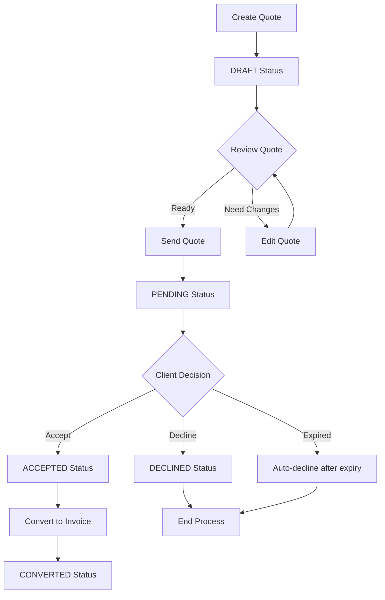
```mermaid
graph TD
    A[Create Quote] --> B[DRAFT Status]
    B --> C{Review Quote}
    C -->|Ready| D[Send Quote]
    C -->|Need Changes| E[Edit Quote]
    E --> C
    D --> F[PENDING Status]
    F --> G{Client Decision}
    G -->|Accept| H[ACCEPTED Status]
    G -->|Decline| I[DECLINED Status]
    G -->|Expired| J[Auto-decline after expiry]
    H --> K[Convert to Invoice]
    K --> L[CONVERTED Status]
    I --> M[End Process]
    J --> M
```

#### Quote Status Transitions
- **DRAFT** → **PENDING**: Via `sendQuote()` function
- **PENDING** → **ACCEPTED**: Via `acceptQuote()` function
- **PENDING** → **DECLINED**: Via `declineQuote()` or auto-expiry
- **ACCEPTED** → **CONVERTED**: Via `convertQuoteToInvoice()`

#### Key Business Rules
- Quotes can be duplicated at any stage via `duplicateQuote()`
- Only DRAFT quotes can be edited
- Quote expiry is handled by daily maintenance tasks
- Activity logging tracks all state changes

### 1.2 Invoice Creation & Processing Flow

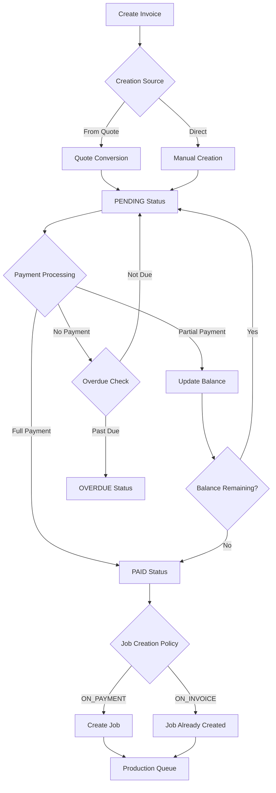
```mermaid
graph TD
    A[Create Invoice] --> B{Creation Source}
    B -->|From Quote| C[Quote Conversion]
    B -->|Direct| D[Manual Creation]
    C --> E[PENDING Status]
    D --> E
    E --> F{Payment Processing}
    F -->|Full Payment| G[PAID Status]
    F -->|Partial Payment| H[Update Balance]
    H --> I{Balance Remaining?}
    I -->|Yes| E
    I -->|No| G
    F -->|No Payment| J{Overdue Check}
    J -->|Past Due| K[OVERDUE Status]
    J -->|Not Due| E
    G --> L{Job Creation Policy}
    L -->|ON_PAYMENT| M[Create Job]
    L -->|ON_INVOICE| N[Job Already Created]
    M --> O[Production Queue]
    N --> O
```

#### Invoice Status Management
- **PENDING**: Default status for new invoices
- **PAID**: When full payment received (balance due = 0)
- **OVERDUE**: Set by daily maintenance when past due date

#### Invoice Operations
- **Mark Paid**: Via `markInvoicePaid()` - creates payment record
- **Mark Unpaid**: Via `markInvoiceUnpaid()` - removes all payments
- **Void**: Via `voidInvoice()` - marks as paid with void reason
- **Write Off**: Via `writeOffInvoice()` - marks as paid with write-off reason
- **Revert to Quote**: Via `revertInvoiceToQuote()` - converts back to quote

### 1.3 Job Creation & Lifecycle

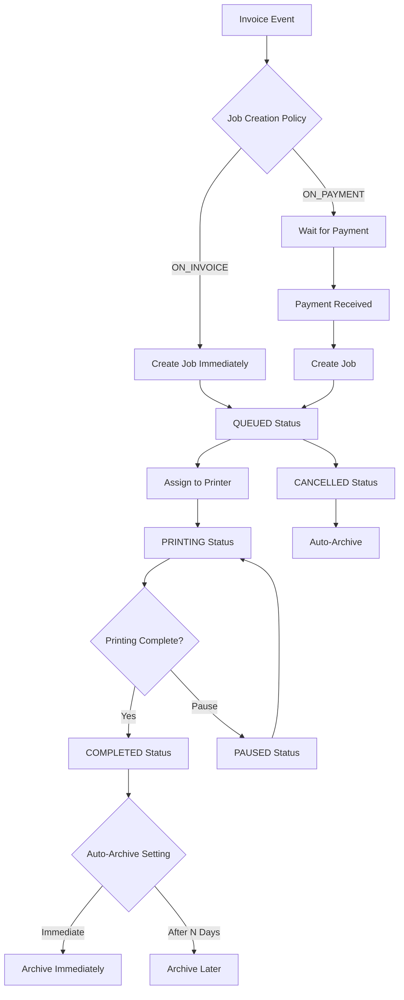
```mermaid
graph TD
    A[Invoice Event] --> B{Job Creation Policy}
    B -->|ON_INVOICE| C[Create Job Immediately]
    B -->|ON_PAYMENT| D[Wait for Payment]
    D --> E[Payment Received]
    E --> F[Create Job]
    C --> G[QUEUED Status]
    F --> G
    G --> H[Assign to Printer]
    H --> I[PRINTING Status]
    I --> J{Printing Complete?}
    J -->|Yes| K[COMPLETED Status]
    J -->|Pause| L[PAUSED Status]
    L --> I
    K --> M{Auto-Archive Setting}
    M -->|Immediate| N[Archive Immediately]
    M -->|After N Days| O[Archive Later]
    G --> P[CANCELLED Status]
    P --> Q[Auto-Archive]
```

#### Job Status Transitions
- **QUEUED**: Initial state, waiting for printer assignment
- **PRINTING**: Active production, requires printer assignment
- **PAUSED**: Temporarily stopped, preserves accumulated time
- **COMPLETED**: Finished successfully
- **CANCELLED**: Stopped permanently, auto-archived

#### Job Management Rules
- Jobs cannot start printing without printer assignment
- Printer capacity limits enforced (default: 1 active job per printer)
- Time tracking: actual hours accumulated during printing sessions
- Queue positions maintained for ordering

---

## 2. Payment Processing Flows

### 2.1 Stripe Payment Workflow

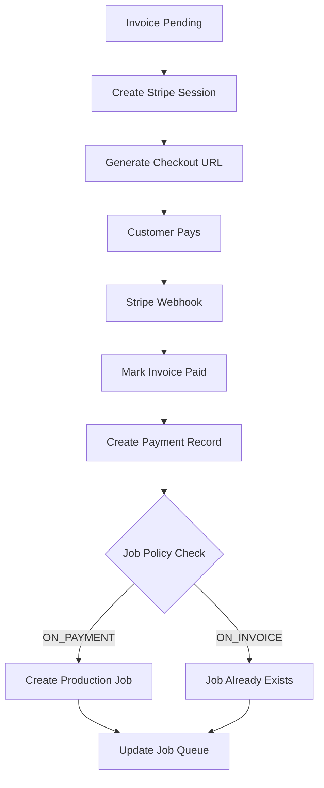
```mermaid
graph TD
    A[Invoice Pending] --> B[Create Stripe Session]
    B --> C[Generate Checkout URL]
    C --> D[Customer Pays]
    D --> E[Stripe Webhook]
    E --> F[Mark Invoice Paid]
    F --> G[Create Payment Record]
    G --> H{Job Policy Check}
    H -->|ON_PAYMENT| I[Create Production Job]
    H -->|ON_INVOICE| J[Job Already Exists]
    I --> K[Update Job Queue]
    J --> K
```

#### Stripe Integration Points
- **Session Creation**: `/api/invoices/[id]/stripe-session`
- **Webhook Handler**: `/api/stripe/webhook`
- **Payment Method**: Automatically set to STRIPE
- **Processor ID**: Stripe payment intent or session ID

### 2.2 Manual Payment Processing

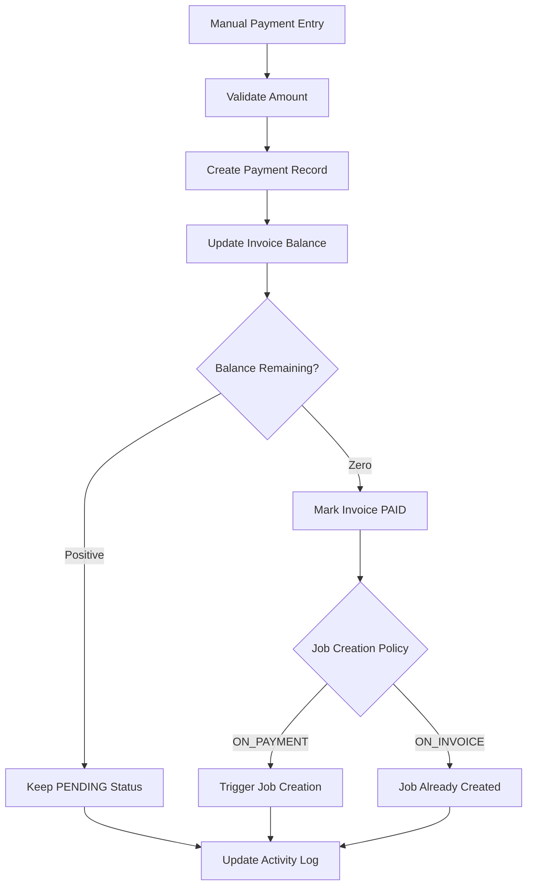
```mermaid
graph TD
    A[Manual Payment Entry] --> B[Validate Amount]
    B --> C[Create Payment Record]
    C --> D[Update Invoice Balance]
    D --> E{Balance Remaining?}
    E -->|Zero| F[Mark Invoice PAID]
    E -->|Positive| G[Keep PENDING Status]
    F --> H{Job Creation Policy}
    H -->|ON_PAYMENT| I[Trigger Job Creation]
    H -->|ON_INVOICE| J[Job Already Created]
    G --> K[Update Activity Log]
    I --> K
    J --> K
```

#### Payment Methods Supported
- **STRIPE**: Automated via checkout
- **BANK_TRANSFER**: Manual entry
- **CASH**: Manual entry
- **OTHER**: Default for manual entries

### 2.3 Payment Recovery & Adjustments

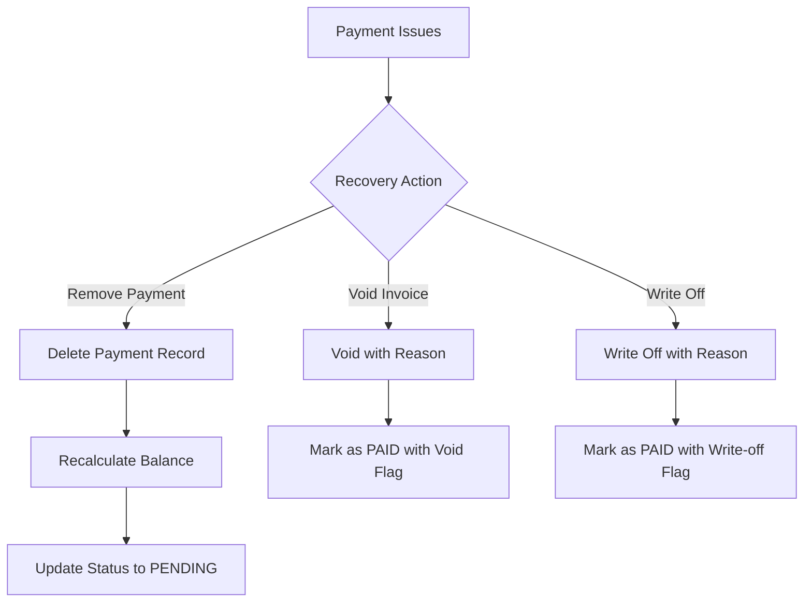
```mermaid
graph TD
    A[Payment Issues] --> B{Recovery Action}
    B -->|Remove Payment| C[Delete Payment Record]
    B -->|Void Invoice| D[Void with Reason]
    B -->|Write Off| E[Write Off with Reason]
    C --> F[Recalculate Balance]
    F --> G[Update Status to PENDING]
    D --> H[Mark as PAID with Void Flag]
    E --> I[Mark as PAID with Write-off Flag]
```

---

## 3. Production Queue Management

### 3.1 Job Board Organization

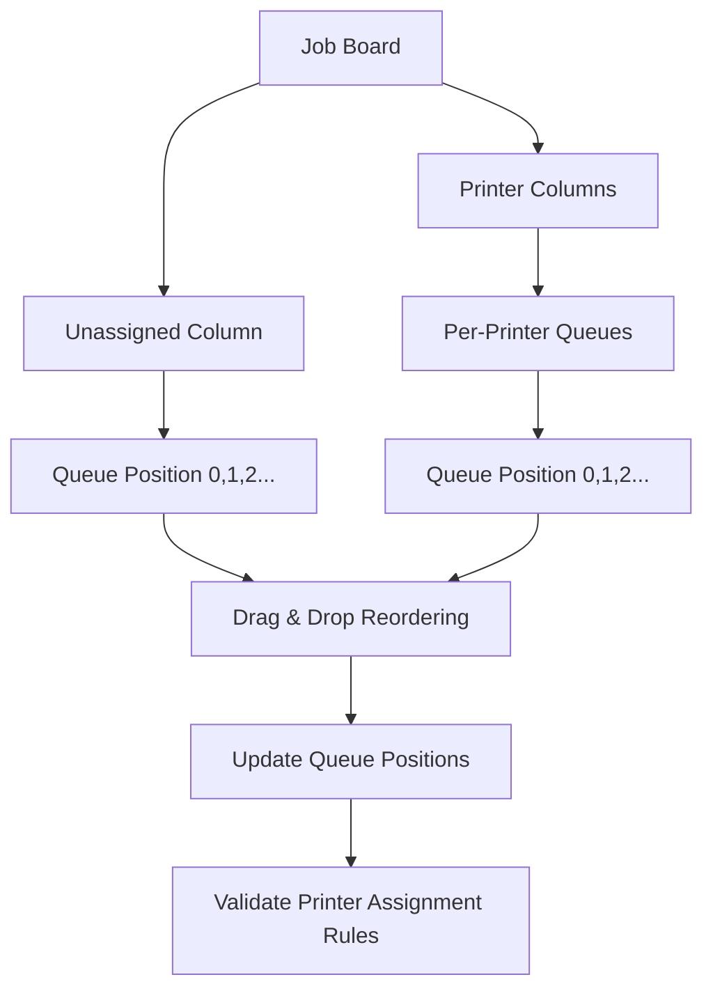
```mermaid
graph TD
    A[Job Board] --> B[Unassigned Column]
    A --> C[Printer Columns]
    B --> D[Queue Position 0,1,2...]
    C --> E[Per-Printer Queues]
    E --> F[Queue Position 0,1,2...]
    D --> G[Drag & Drop Reordering]
    F --> G
    G --> H[Update Queue Positions]
    H --> I[Validate Printer Assignment Rules]
```

#### Queue Management Rules
- **Unassigned Jobs**: Default queue for new jobs
- **Printer Assignment**: Jobs can be assigned to specific printers
- **Queue Ordering**: Maintained via `queuePosition` field
- **Drag & Drop**: Updates both position and printer assignment

### 3.2 Printer Status & Constraints

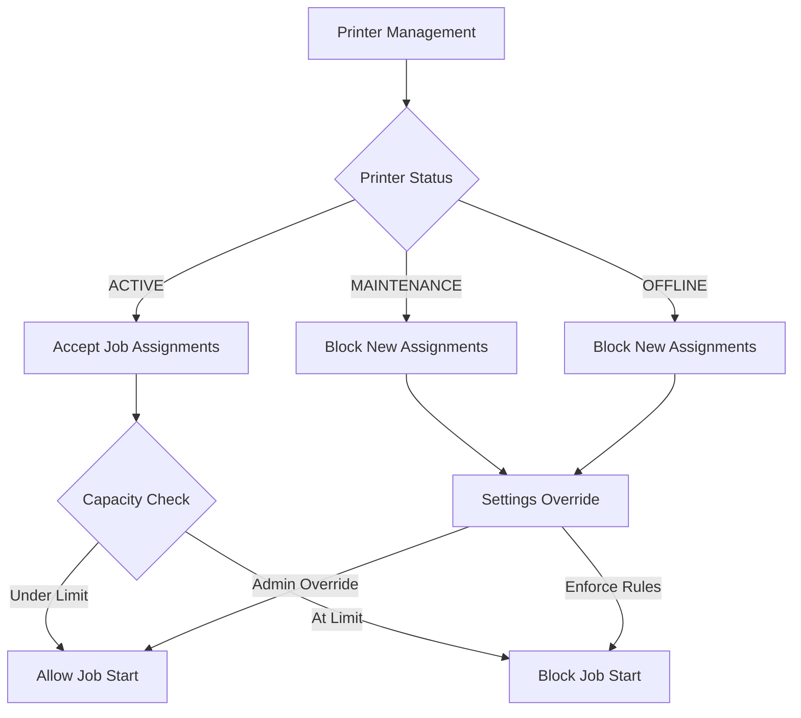
```mermaid
graph TD
    A[Printer Management] --> B{Printer Status}
    B -->|ACTIVE| C[Accept Job Assignments]
    B -->|MAINTENANCE| D[Block New Assignments]
    B -->|OFFLINE| E[Block New Assignments]
    C --> F{Capacity Check}
    F -->|Under Limit| G[Allow Job Start]
    F -->|At Limit| H[Block Job Start]
    D --> I[Settings Override]
    E --> I
    I -->|Admin Override| G
    I -->|Enforce Rules| H
```

#### Printer Status Rules
- **ACTIVE**: Normal operation, accepts new jobs
- **MAINTENANCE**: Blocks new assignments (configurable)
- **OFFLINE**: Blocks new assignments (configurable)
- **Capacity Limits**: Max active jobs per printer (default: 1)

### 3.3 Job Completion & Auto-Management

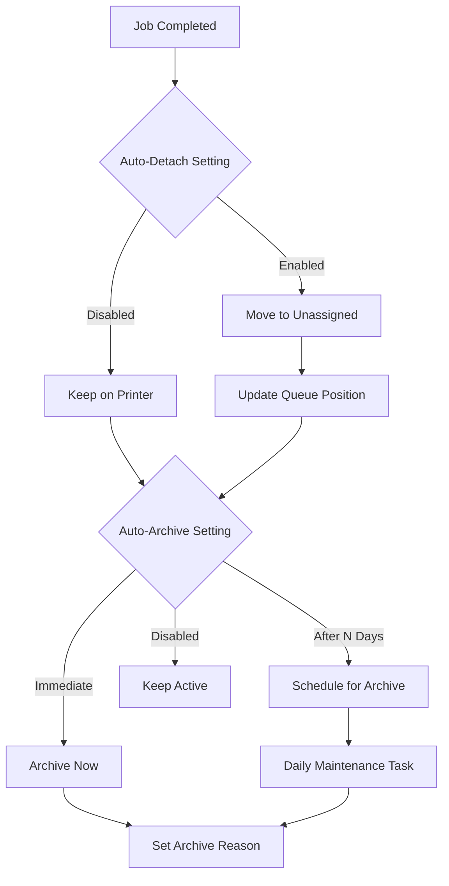
```mermaid
graph TD
    A[Job Completed] --> B{Auto-Detach Setting}
    B -->|Enabled| C[Move to Unassigned]
    B -->|Disabled| D[Keep on Printer]
    C --> E[Update Queue Position]
    D --> F{Auto-Archive Setting}
    E --> F
    F -->|Immediate| G[Archive Now]
    F -->|After N Days| H[Schedule for Archive]
    F -->|Disabled| I[Keep Active]
    G --> J[Set Archive Reason]
    H --> K[Daily Maintenance Task]
    K --> J
```

---

## 4. Client Interaction Touchpoints

### 4.1 Client Onboarding & Management

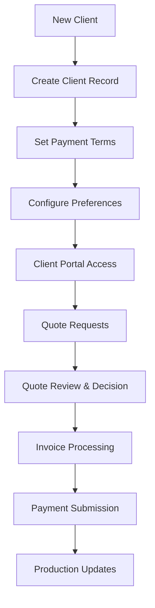
```mermaid
graph TD
    A[New Client] --> B[Create Client Record]
    B --> C[Set Payment Terms]
    C --> D[Configure Preferences]
    D --> E[Client Portal Access]
    E --> F[Quote Requests]
    F --> G[Quote Review & Decision]
    G --> H[Invoice Processing]
    H --> I[Payment Submission]
    I --> J[Production Updates]
```

#### Client Data Management
- **Core Info**: Name, company, contact details
- **Payment Terms**: Custom or default terms
- **Activity History**: All interactions logged
- **Notes**: Internal notes for client management

### 4.2 Quote Interaction Workflow

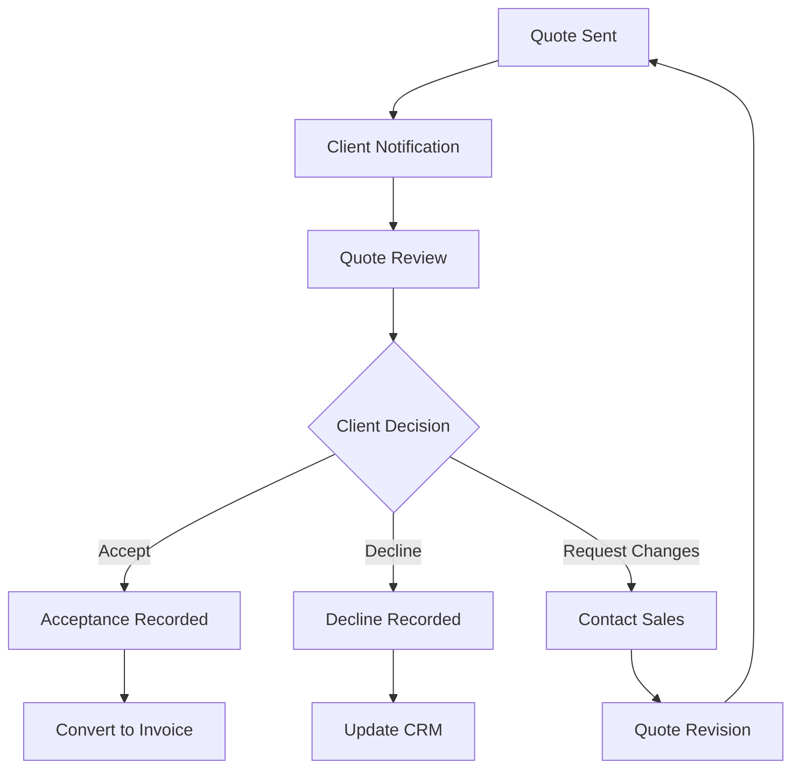
```mermaid
graph TD
    A[Quote Sent] --> B[Client Notification]
    B --> C[Quote Review]
    C --> D{Client Decision}
    D -->|Accept| E[Acceptance Recorded]
    D -->|Decline| F[Decline Recorded]
    D -->|Request Changes| G[Contact Sales]
    E --> H[Convert to Invoice]
    F --> I[Update CRM]
    G --> J[Quote Revision]
    J --> A
```

### 4.3 Payment Experience

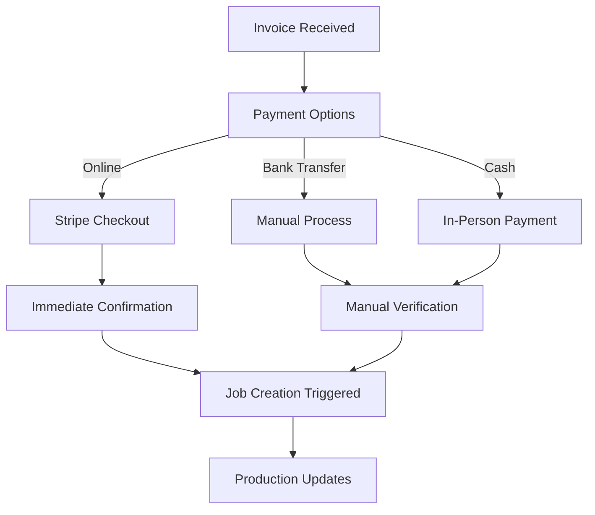
```mermaid
graph TD
    A[Invoice Received] --> B[Payment Options]
    B -->|Online| C[Stripe Checkout]
    B -->|Bank Transfer| D[Manual Process]
    B -->|Cash| E[In-Person Payment]
    C --> F[Immediate Confirmation]
    D --> G[Manual Verification]
    E --> G
    F --> H[Job Creation Triggered]
    G --> H
    H --> I[Production Updates]
```

---

## 5. Automated Processes & Triggers

### 5.1 Daily Maintenance Tasks

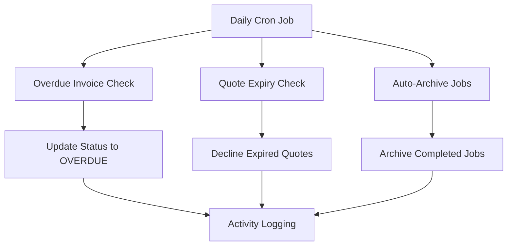
```mermaid
graph TD
    A[Daily Cron Job] --> B[Overdue Invoice Check]
    A --> C[Quote Expiry Check]
    A --> D[Auto-Archive Jobs]
    B --> E[Update Status to OVERDUE]
    C --> F[Decline Expired Quotes]
    D --> G[Archive Completed Jobs]
    E --> H[Activity Logging]
    F --> H
    G --> H
```

#### Maintenance Operations
- **Overdue Invoices**: Check `dueDate` against current date
- **Quote Expiry**: Check `expiryDate` and `expiresAt` fields
- **Job Archiving**: Archive completed jobs after configured days
- **Settings Driven**: All thresholds configurable in settings

### 5.2 Job Creation Triggers

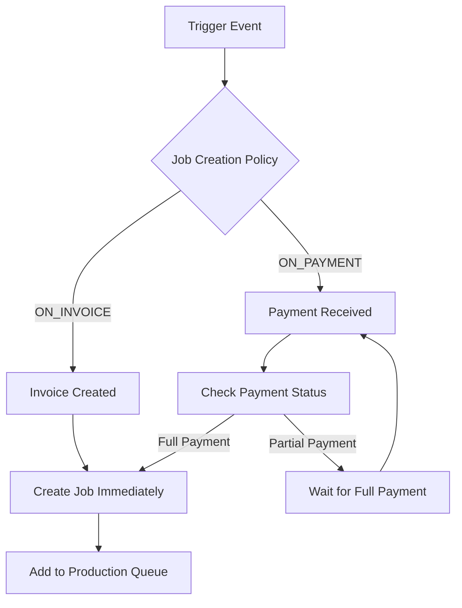
```mermaid
graph TD
    A[Trigger Event] --> B{Job Creation Policy}
    B -->|ON_INVOICE| C[Invoice Created]
    B -->|ON_PAYMENT| D[Payment Received]
    C --> E[Create Job Immediately]
    D --> F[Check Payment Status]
    F -->|Full Payment| E
    F -->|Partial Payment| G[Wait for Full Payment]
    E --> H[Add to Production Queue]
    G --> D
```

### 5.3 Status Cascade Effects

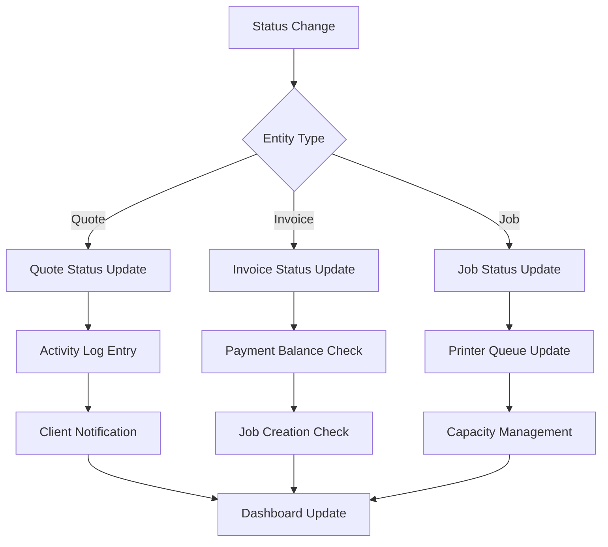
```mermaid
graph TD
    A[Status Change] --> B{Entity Type}
    B -->|Quote| C[Quote Status Update]
    B -->|Invoice| D[Invoice Status Update]
    B -->|Job| E[Job Status Update]
    C --> F[Activity Log Entry]
    D --> G[Payment Balance Check]
    E --> H[Printer Queue Update]
    F --> I[Client Notification]
    G --> J[Job Creation Check]
    H --> K[Capacity Management]
    I --> L[Dashboard Update]
    J --> L
    K --> L
```

---

## 6. Status Transitions & Business Rules

### 6.1 Quote Status Business Rules

| From Status | To Status | Trigger | Conditions |
|-------------|-----------|---------|------------|
| DRAFT | PENDING | Send Quote | Manual action |
| PENDING | ACCEPTED | Accept Quote | Client/admin action |
| PENDING | DECLINED | Decline Quote | Client/admin/expiry |
| ACCEPTED | CONVERTED | Convert to Invoice | Manual action |
| Any | DRAFT | Duplicate Quote | Creates new quote |

### 6.2 Invoice Status Business Rules

| From Status | To Status | Trigger | Conditions |
|-------------|-----------|---------|------------|
| PENDING | PAID | Payment Received | Balance due = 0 |
| PENDING | OVERDUE | Daily Maintenance | Past due date |
| OVERDUE | PAID | Payment Received | Balance due = 0 |
| PAID | PENDING | Payment Removed | Balance due > 0 |
| Any | PENDING | Revert to Quote | No payments, not paid |

### 6.3 Job Status Business Rules

| From Status | To Status | Trigger | Conditions |
|-------------|-----------|---------|------------|
| QUEUED | PRINTING | Start Job | Printer assigned |
| PRINTING | PAUSED | Pause Job | Manual action |
| PRINTING | COMPLETED | Complete Job | Manual action |
| PAUSED | PRINTING | Resume Job | Manual action |
| Any | CANCELLED | Cancel Job | Manual action |
| COMPLETED | Archived | Auto-Archive | Time-based or immediate |

### 6.4 Cross-Entity Business Rules

#### Invoice to Job Creation
- **ON_INVOICE Policy**: Job created when invoice is created
- **ON_PAYMENT Policy**: Job created when invoice is fully paid
- **One Job per Invoice**: Each invoice can have only one job

#### Quote to Invoice Conversion
- **Quote Status**: Must be ACCEPTED to convert
- **Data Transfer**: All line items, totals, and terms copied
- **Status Updates**: Quote becomes CONVERTED, Invoice becomes PENDING

#### Payment to Job Triggering
- **Full Payment**: Only triggers job creation when balance due = 0
- **Partial Payments**: Update balance but don't trigger job creation
- **Payment Removal**: May affect existing jobs (business decision)

---

## 7. Error Handling & Recovery Workflows

### 7.1 Payment Failure Recovery

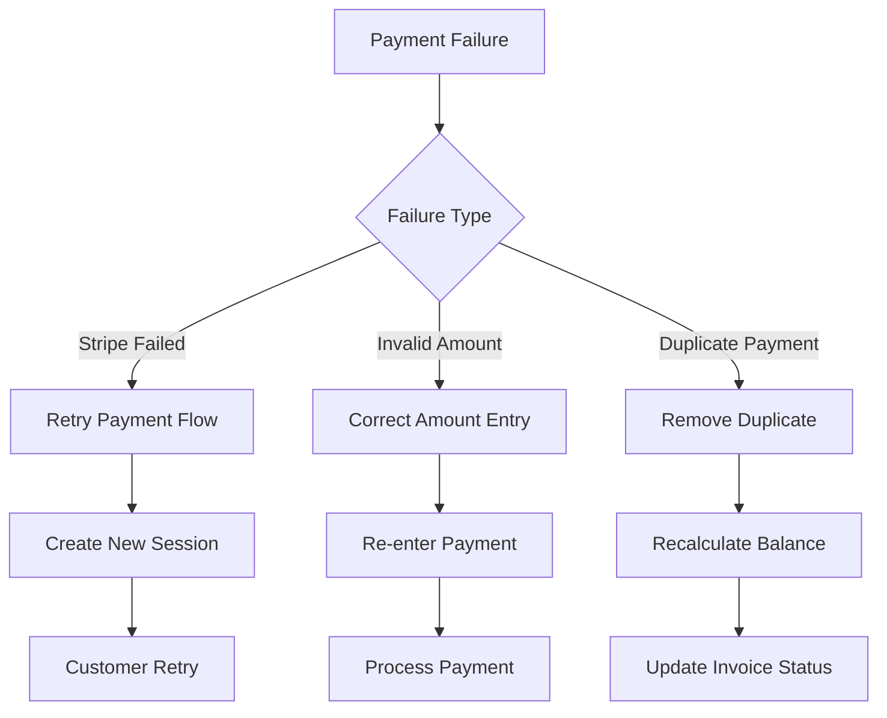
```mermaid
graph TD
    A[Payment Failure] --> B{Failure Type}
    B -->|Stripe Failed| C[Retry Payment Flow]
    B -->|Invalid Amount| D[Correct Amount Entry]
    B -->|Duplicate Payment| E[Remove Duplicate]
    C --> F[Create New Session]
    D --> G[Re-enter Payment]
    E --> H[Recalculate Balance]
    F --> I[Customer Retry]
    G --> J[Process Payment]
    H --> K[Update Invoice Status]
```

### 7.2 Job Assignment Failures

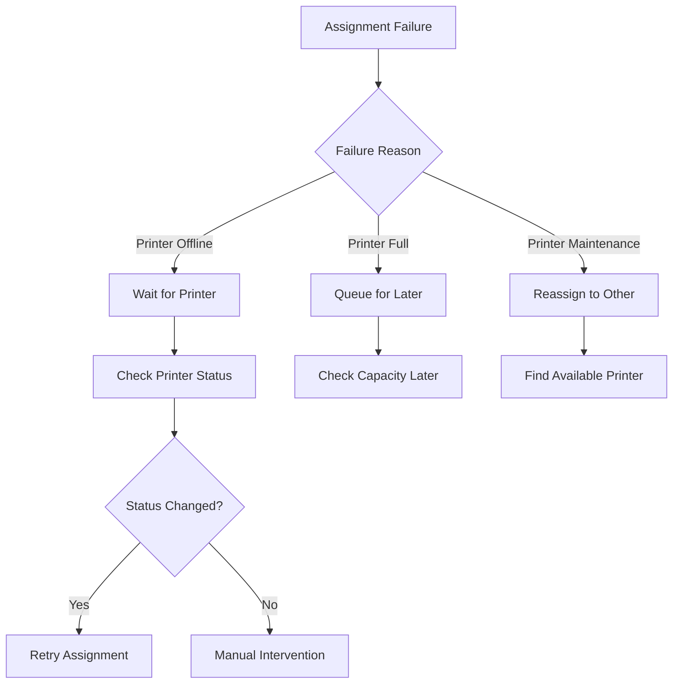
```mermaid
graph TD
    A[Assignment Failure] --> B{Failure Reason}
    B -->|Printer Offline| C[Wait for Printer]
    B -->|Printer Full| D[Queue for Later]
    B -->|Printer Maintenance| E[Reassign to Other]
    C --> F[Check Printer Status]
    D --> G[Check Capacity Later]
    E --> H[Find Available Printer]
    F --> I{Status Changed?}
    I -->|Yes| J[Retry Assignment]
    I -->|No| K[Manual Intervention]
```

### 7.3 Data Integrity Recovery

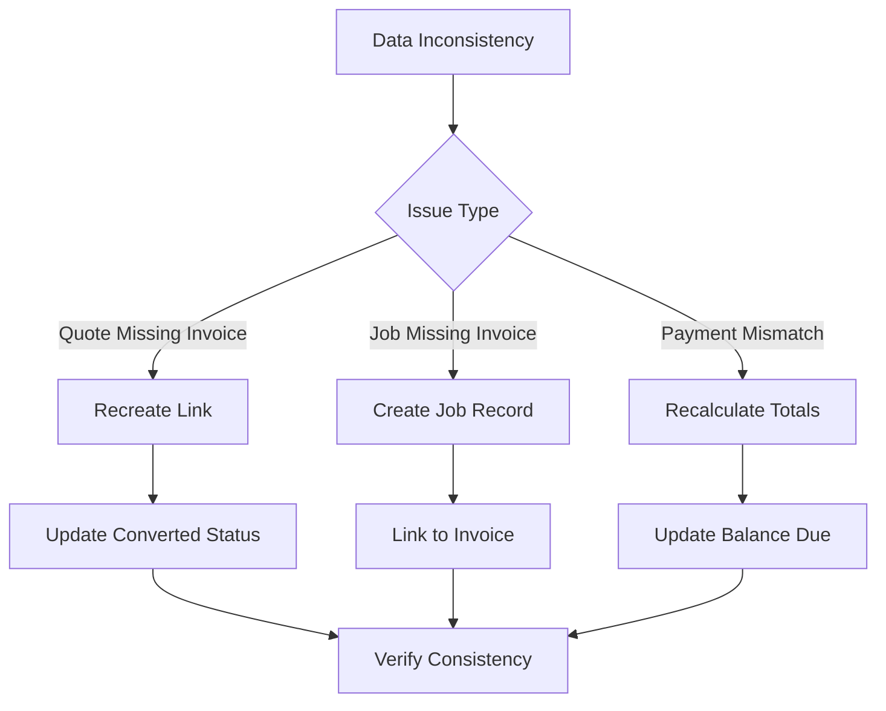
```mermaid
graph TD
    A[Data Inconsistency] --> B{Issue Type}
    B -->|Quote Missing Invoice| C[Recreate Link]
    B -->|Job Missing Invoice| D[Create Job Record]
    B -->|Payment Mismatch| E[Recalculate Totals]
    C --> F[Update Converted Status]
    D --> G[Link to Invoice]
    E --> H[Update Balance Due]
    F --> I[Verify Consistency]
    G --> I
    H --> I
```

### 7.4 System Recovery Procedures

#### Database Consistency Checks
- **Quote-Invoice Links**: Verify convertedInvoiceId relationships
- **Payment Totals**: Ensure balance due calculations are correct
- **Job Assignments**: Validate printer capacity constraints
- **Queue Positions**: Check for gaps or duplicates in queue ordering

#### Automated Recovery Actions
- **Recalculate Invoice Balances**: Sum payments and update balance due
- **Refresh Job Queues**: Reorder positions and validate assignments
- **Clean Orphaned Records**: Remove incomplete or invalid records
- **Audit Trail Verification**: Ensure all changes are logged

---

## 8. Administrative Workflows

### 8.1 System Configuration Management

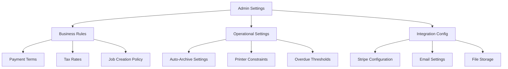
```mermaid
graph TD
    A[Admin Settings] --> B[Business Rules]
    A --> C[Operational Settings]
    A --> D[Integration Config]
    B --> E[Payment Terms]
    B --> F[Tax Rates]
    B --> G[Job Creation Policy]
    C --> H[Auto-Archive Settings]
    C --> I[Printer Constraints]
    C --> J[Overdue Thresholds]
    D --> K[Stripe Configuration]
    D --> L[Email Settings]
    D --> M[File Storage]
```

### 8.2 User Management & Permissions

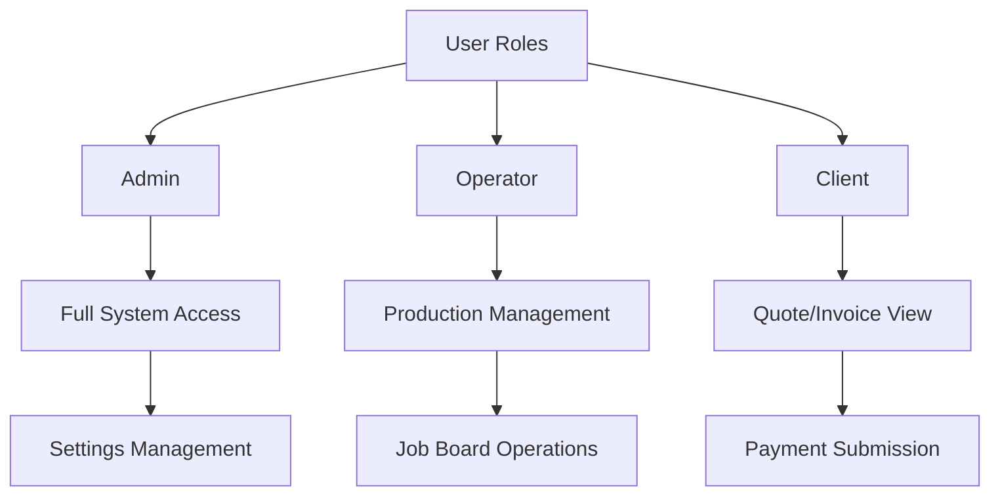
```mermaid
graph TD
    A[User Roles] --> B[Admin]
    A --> C[Operator]
    A --> D[Client]
    B --> E[Full System Access]
    C --> F[Production Management]
    D --> G[Quote/Invoice View]
    E --> H[Settings Management]
    F --> I[Job Board Operations]
    G --> J[Payment Submission]
```

### 8.3 Reporting & Analytics Workflows

```mermaid
graph TD
    A[Dashboard Metrics] --> B[Revenue Tracking]
    A --> C[Production Metrics]
    A --> D[Client Analytics]
    B --> E[30-Day Revenue]
    B --> F[Outstanding Balance]
    B --> G[Payment Trends]
    C --> H[Job Queue Status]
    C --> I[Printer Utilization]
    C --> J[Completion Rates]
    D --> K[Quote Conversion]
    D --> L[Payment Patterns]
    D --> M[Client Activity]
```

### 8.4 Data Export & Integration

```mermaid
graph TD
    A[Export Requests] --> B[Payment Export]
    A --> C[Invoice Export]
    A --> D[Job Export]
    A --> E[Printer Utilization]
    A --> F[Material Usage]
    B --> G[Accounting Integration]
    C --> H[Financial Reports]
    D --> I[Production Reports]
    E --> J[Capacity Planning]
    F --> K[Inventory Management]
```

#### Available Export Endpoints
- `/api/export/payments` - Payment history for accounting
- `/api/export/invoices` - Invoice data for financial reporting
- `/api/export/jobs` - Production data for analysis
- `/api/export/printer-utilization` - Equipment usage metrics
- `/api/export/material-usage` - Material consumption tracking
- `/api/export/ar-aging` - Accounts receivable aging report

---

## Workflow Integration Points

### External System Integration
- **Stripe**: Payment processing and webhook handling
- **Email System**: Quote/invoice delivery (configurable)
- **File Storage**: Invoice attachments and document management
- **Accounting Systems**: Via export APIs

### Internal System Dependencies
- **Activity Logging**: All workflows generate audit trails
- **Dashboard Updates**: Real-time metrics updated by workflow changes
- **Queue Management**: Production workflows affect job scheduling
- **Client Portal**: Workflow states visible to clients

### Performance Considerations
- **Database Transactions**: Critical workflows use atomic operations
- **Background Processing**: Long-running tasks use async processing
- **Caching**: Dashboard metrics cached for performance
- **Bulk Operations**: Batch processing for efficiency

---

## Conclusion

This workflow documentation provides a comprehensive view of the 3D Print Sydney business processes. The system is designed with clear separation of concerns, automated business rule enforcement, and comprehensive audit trails. All workflows support both manual intervention and automated processing, ensuring flexibility while maintaining data integrity.

The modular design allows for easy extension and modification of business rules through the settings system, while the comprehensive logging ensures full traceability of all business operations.